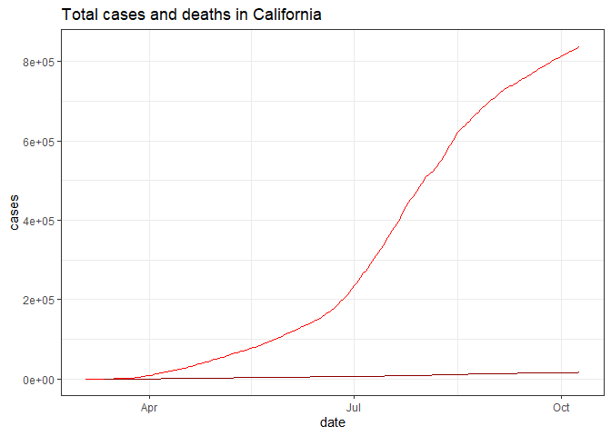
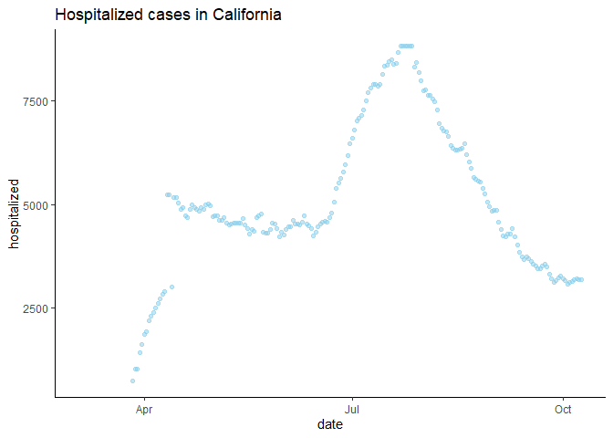
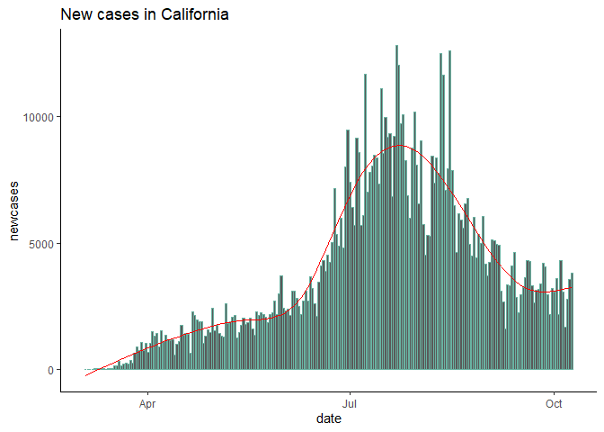
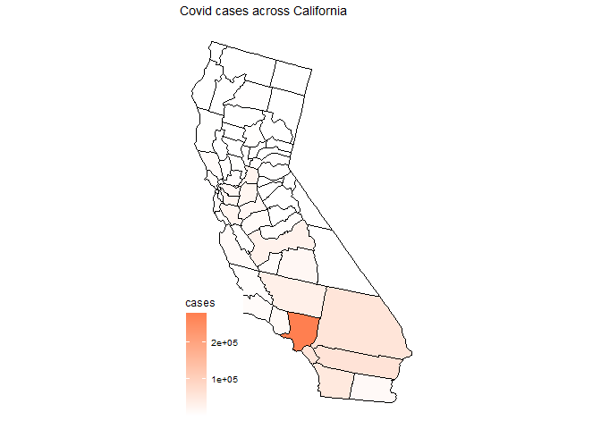
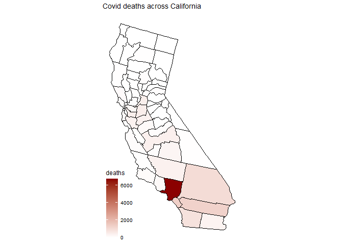

Midterm
================
Lin Wang
10/7/2020

You can view the report
[here](https://ghcdn.rawgit.org/HopeW233/PM566-Midterm/master/README.html)

## Introduction

### 1\. Dataset

The datasets I used are:

California daily covid data from
<https://covidtracking.com/data/download>

Covid data per US counties by NYT
<https://raw.githubusercontent.com/nytimes/covid-19-data/master/us-counties.csv>

Both datasets include daily covid data such as cases, deaths, new cases,
etc. California data starts from 03/04/2020, and county data starts from
01/21/2020.

### 2\. Formulated question

I am going to look at California covid cases and trends. The main
questions for this project are:

1.  Which day has the most number of new cases and new deaths?

2.  What is the trend of daily new cases?

3.  What is the difference of covid trend between 2nd quarter and 3th
    quarter?

4.  Which county has the most number of cases and deaths?

## Methods

### 1\. Read in the data, EDA

  - I choose data.table:: to download and read in large dataset, in
    order to keep latest covid history, I use download.file() and
    fread() to get updated daily data from the website.

  - First I follow the EDA checklist to check dimensions, headers,
    footers, variable names and variable types. CA history data has 43
    columns and 220 rows with IDate, int, char, logi variables, the
    first observation was on 03/04/2020. While county data has 6 columns
    and 612238 rows with IDate, chr, int variables(10/9), the first
    observation was on 01/21/2020.

<!-- end list -->

``` r
# Getting CA covid history data
download.file("https://covidtracking.com/data/download/california-history.csv", destfile = "california-history.csv")
dat <- fread("california-history.csv")

# Getting covid data per county in CA
download.file("https://raw.githubusercontent.com/nytimes/covid-19-data/master/us-counties.csv", destfile = "us-counties.csv", method="libcurl", timeout = 60)
counties <- fread("us-counties.csv")
```

### 2\. Create new column, rename the key variables, convert variable type, check any missing values

  - Next, datasets are filtered and selected using data.table:: and
    dplyr::. I list needed variables and rename some of them, and create
    a quarter variable in CA history data by selecting data from
    04/01/2020 - 09/30/2020. And I filter county data where state equals
    to CA. I also convert type of the date variable for further use. As
    for missing value, I keep some NA’s in death and new cases columns
    because it would not affect our analysis.

  - Now I get two datasets named as covid\_ca and counties, I’ll use
    summary(), count(), table() to explore variable features and summary
    statistics.

<!-- end list -->

``` r
# selecting columns we need
dat <- dat[, .(date, state, death, deathIncrease, hospitalizedCurrently, positive, positiveIncrease, totalTestResults)] %>%
  rename(hospitalized = hospitalizedCurrently, newcases = positiveIncrease, cases = positive, tests = totalTestResults)

dat$date <- as.Date(dat$date)

# Creating Quarter variable
dat[date>="2020-04-01" & date<="2020-06-30", Quarter := "Q1"]
dat[date>="2020-07-01" & date<="2020-09-30", Quarter := "Q2"]

covid_ca <- dat[date>="2020-04-01" & date<="2020-09-30"][order(date, decreasing = FALSE)]

# Filtering CA data
counties <- counties %>%
  filter(state == "California")

counties$date <- as.Date(counties$date)
```

### 3\. Data visualization

  - The tools I use to visualized data mainly are ggplot() with multiple
    types of plot, usmap:: to present state map, kable() to make
    well-organized tables.

## Preliminary Results

### 1\. Overview of covid cases, deaths, hospitalized cases, new cases in CA

``` r
ggplot(dat)+
  geom_line(mapping = aes(x = date, y = cases), col="red", na.rm = TRUE)+
  geom_line(mapping = aes(x = date, y = death), col = "darkred", na.rm = TRUE)+
  ggtitle("Total cases and deaths in California")+
  theme_bw()
```

<!-- -->

``` r
ggplot(dat)+
  geom_line(mapping = aes(x = date, y = death), col = "darkred", na.rm = TRUE)+
  ggtitle("Total deaths in California")+
  theme_bw()
```

<!-- -->

``` r
ggplot(dat)+
  geom_point(mapping = aes(x = date, y = hospitalized), na.rm = TRUE, col="skyblue", alpha = 0.5)+
  ggtitle("Hospitalized cases in California")+
  theme_classic()
```

<!-- -->

``` r
ggplot(dat, mapping = aes(x = date))+
  geom_bar(aes(y = newcases), position = "stack", stat = "identity", col="#69b3a2", show.legend = TRUE, na.rm = TRUE)+
  stat_smooth(aes(date, newcases), method = "gam", color = "red", size = 0.5, se = FALSE)+
  ggtitle("New cases in California")+
  theme_classic()
```

<!-- -->

  - The updated total cases and deaths are 838606 and 16428, they share
    a similar increasing trend by date.
  - Cases hospitalized plot has a peak on early April and late July.
  - New cases plot has a sharp increase on July, and is getting
    decreased after the peak.

### 2\. Covid trend by quarters and months

``` r
# New cases by quarters
ggplot(covid_ca)+
  geom_boxplot(mapping = aes(group = Quarter, y = newcases, color = Quarter, fill = Quarter, alpha = 0.5))+
  ggtitle("New cases in California by quarters")+
  theme_classic()
```

<!-- -->

``` r
# Take a look at different month
covid_ca1 = mutate(covid_ca, month=substr(covid_ca$date, 6, 7))
ggplot(covid_ca1)+
  geom_point(mapping = aes(x = date, y = newcases, color = month))+
  stat_smooth(aes(x = date, y = newcases, color = month), method = lm, se = FALSE)+
  ggtitle("New cases in California by month")+
  theme_classic()
```

<!-- -->

``` r
# Statistical summary graph
ggplot(covid_ca1, mapping = aes(x = month, y = newcases))+
  stat_summary(fun.data = "mean_sdl")+
  ggtitle("Statistical summary graphs of new cases by month")+
  theme_bw()
```

<!-- -->

  - The 3th quarter(mean new\_cases: 5000+) has more new cases than 2nd
    quarter(mean new\_cases: 2500-).
  - New cases is increasing drastically on June and get the top on July,
    it has a decreasing trend on the beginning of the August, which
    suggests precautions such as wearing mask and social distancing have
    impact on covid spread prevention. Overall, 3th quarter has more new
    cases.
  - Statistical summary graph show same results with plots, July and
    August have most new cases.

### 3\. County with top cases and deaths

``` r
# Getting the counties with top ten cases and deaths
top_cases <- counties %>%
  filter(date == max(date)) %>%
  select(county, cases) %>%
  arrange(desc(cases))
top_10_cases <- top_cases[1:10,]

top_deaths <- counties %>%
  filter(date == max(date)) %>%
  select(county, deaths) %>%
  arrange(desc(deaths))
top_10_deaths <- top_deaths[1:10,]

# plot
ggplot(top_10_cases, aes(x = reorder(county, -cases)))+
  geom_bar(aes(y = cases), position = "stack", stat = "identity", fill = "skyblue")+
  labs(title = "Counties in CA with top ten cases", x = "County", y = "Cases")+
  theme_bw()
```

<!-- -->

``` r
ggplot(top_10_deaths, aes(x = reorder(county, -deaths)))+
  geom_bar(aes(y = deaths), position = "stack", stat = "identity", fill = "salmon")+
  labs(title = "Counties in CA with top ten deaths", x = "County", y = "Deaths")+
  theme_bw()
```

<!-- -->

  - Los Angeles is the county with the most number of cases and deaths.

<!-- end list -->

``` r
# Plotting a state map
library(usmap)
map <- counties %>%
  filter(date == max(date)) %>%
  select(fips, cases, deaths)

plot_usmap("counties", data = map, values = "cases", include = "CA")+
  scale_fill_continuous(low = "white", high = "coral")+
  labs(title = "Covid cases across California", fill = "cases")
```

<!-- -->

``` r
plot_usmap("counties", data = map, values = "deaths", include = "CA")+
  scale_fill_continuous(low = "white", high = "darkred")+
  labs(title = "Covid deaths across California", fill = "deaths")
```

<!-- -->

### 4\. Take a look at Los Angeles County

``` r
lac <- counties %>%
  filter(county == "Los Angeles") %>%
  mutate(newcases = cases - lag(cases, 1)) %>%
  arrange(desc(cases))

ggplot(lac)+
  geom_line(mapping = aes(x = date, y = newcases, color = "newcases"), position = "stack", size = 0.7, na.rm = TRUE)+
  stat_smooth(aes(date, newcases), method = "gam", color = "red", size = 0.5, se = FALSE)+
  geom_line(mapping = aes(x = date, y = deaths, color = "deaths"), size = 0.7, na.rm = TRUE)+
  stat_smooth(aes(x = date, y = deaths), size = 0.5)+
  ggtitle("New cases and deaths in LA County")+
  theme_bw()
```

<!-- -->

  - The deaths line has a linear trend after April, the new cases line
    share a similar trend with state level.

### 5\. Tables

``` r
# Getting the day with the most number of new cases and new deaths
newcases <- dat %>%
  filter(newcases == max(newcases)) %>%
  select(date, newcases) 

deaths <- dat %>%
  filter(deathIncrease == max(deathIncrease)) %>%
  select(date, deathIncrease) 

knitr::kable(
  list(newcases, deaths),
  caption = "Day with the most number of new cases and deaths")
```

<table class="kable_wrapper">

<caption>

Day with the most number of new cases and deaths

</caption>

<tbody>

<tr>

<td>

| date       | newcases |
| :--------- | -------: |
| 2020-07-22 |    12807 |

</td>

<td>

| date       | deathIncrease |
| :--------- | ------------: |
| 2020-08-01 |           219 |

</td>

</tr>

</tbody>

</table>

``` r
# Getting counties with top ten cases and deaths
knitr::kable(
  list(top_10_cases, top_10_deaths),
  caption = 'Counties with top ten cases and deaths.',
  booktabs = TRUE, valign = 't'
)
```

<table class="kable_wrapper">

<caption>

Counties with top ten cases and deaths.

</caption>

<tbody>

<tr>

<td>

| county         |  cases |
| :------------- | -----: |
| Los Angeles    | 278665 |
| Riverside      |  61416 |
| San Bernardino |  57203 |
| Orange         |  56800 |
| San Diego      |  49529 |
| Kern           |  32741 |
| Fresno         |  29069 |
| Sacramento     |  23522 |
| Santa Clara    |  22154 |
| Alameda        |  21959 |

</td>

<td>

| county         | deaths |
| :------------- | -----: |
| Los Angeles    |   6726 |
| Orange         |   1306 |
| Riverside      |   1248 |
| San Bernardino |    974 |
| San Diego      |    819 |
| San Joaquin    |    473 |
| Sacramento     |    447 |
| Alameda        |    440 |
| Fresno         |    406 |
| Kern           |    387 |

</td>

</tr>

</tbody>

</table>

``` r
# Latest summary
dat[!is.na(cases), positiveprop := cases/tests]
latest <- dat[1, .(date, state, death, deathIncrease, hospitalized, cases, newcases, tests, positiveprop)]

knitr::kable(x = latest, caption = "Latest Covid Summary in CA")
```

| date       | state | death | deathIncrease | hospitalized |  cases | newcases |    tests | positiveprop |
| :--------- | :---- | ----: | ------------: | -----------: | -----: | -------: | -------: | -----------: |
| 2020-10-09 | CA    | 16428 |            67 |         3186 | 838606 |     3806 | 15736497 |    0.0532905 |

Latest Covid Summary in CA

``` r
lat_lac <- lac[1, .(date, county, cases, deaths, newcases)]
knitr::kable(x = lat_lac, caption = "Latest Covid Summary in LAC")
```

| date       | county      |  cases | deaths | newcases |
| :--------- | :---------- | -----: | -----: | -------: |
| 2020-10-08 | Los Angeles | 278665 |   6726 |     1220 |

Latest Covid Summary in LAC

## Conclusion

  - 07/22/2020 is the day has the most new cases and 08/01/2020 has the
    most new deaths in CA.

  - Daily new cases is increasing sharply on June, and has a peak at
    July and August, now it is decreasing gradually.

  - The 3th quarter has more new cases than the 2nd quarter, and it has
    a mean of new cases at 5000+.

  - Los Angeles county has the most number of cases and deaths which is
    278665 and 6726 respectively.

  - Covid pattern may be affected by people’s behavior and public health
    orders, that’s what I’m interested and may analyze it later.
