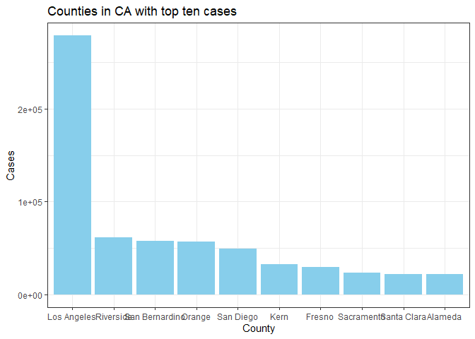

Midterm
================
Lin Wang
10/7/2020

# Introduction

``` r
# Get CA covid history data
dat <- data.table::fread("/Users/Hope/Documents/PM566-Midterm/california-history.csv")

dat <- dat[, .(date, state, death, deathIncrease, hospitalizedCurrently, positive, positiveIncrease, totalTestResults)] %>%
  rename(hospitalized = hospitalizedCurrently, newcases = positiveIncrease, cases = positive, tests = totalTestResults)

dat$date <- as.Date(dat$date)

# Create Quarter variable
dat[date>="2020-04-01" & date<="2020-06-30", Quarter := "Q1"]
dat[date>="2020-07-01" & date<="2020-09-30", Quarter := "Q2"]

covid_ca <- dat[date>="2020-04-01" & date<="2020-09-30"] 
covid_ca[order(date, decreasing = FALSE)]
```

    ##            date state death deathIncrease hospitalized  cases newcases    tests
    ##   1: 2020-04-01    CA   171            18         1855   8155      673    29927
    ##   2: 2020-04-02    CA   203            32         1922   9191     1036    33000
    ##   3: 2020-04-03    CA   237            34         2188  10701     1510    35300
    ##   4: 2020-04-04    CA   276            39         2300  12026     1325   113700
    ##   5: 2020-04-05    CA   319            43         2398  13438     1412   116533
    ##  ---                                                                           
    ## 179: 2020-09-26    CA 15532           134         3203 798237     4197 14182730
    ## 180: 2020-09-27    CA 15587            55         3129 802308     4071 14333498
    ## 181: 2020-09-28    CA 15608            21         3160 805263     2955 14484852
    ## 182: 2020-09-29    CA 15640            32         3223 807425     2162 14613545
    ## 183: 2020-09-30    CA 15792           152         3267 810625     3200 14705202
    ##      Quarter
    ##   1:      Q1
    ##   2:      Q1
    ##   3:      Q1
    ##   4:      Q1
    ##   5:      Q1
    ##  ---        
    ## 179:      Q2
    ## 180:      Q2
    ## 181:      Q2
    ## 182:      Q2
    ## 183:      Q2

``` r
# Get covid data of counties in CA
download.file("https://raw.githubusercontent.com/nytimes/covid-19-data/master/us-counties.csv", "us-counties.csv")
counties <- fread("us-counties.csv")
counties <- counties %>%
  filter(state == "California")

counties$date <- as.Date(counties$date)
```

``` r
# Overview of covid tests, deaths, hospitalizedIncrease, new cases in CA
ggplot(dat, mapping = aes(x = date, y = cases))+
  geom_line(color="red")+
  ggtitle("Total positive cases in California")+
  theme_bw()
```

<!-- -->

``` r
ggplot(dat)+
  geom_line(mapping = aes(x = date, y = death), col = "darkred", na.rm = TRUE)+
  ggtitle("Total deaths in California")+
  theme_bw()
```

<!-- -->

``` r
ggplot(dat)+
  geom_point(mapping = aes(x = date, y = hospitalized), na.rm = TRUE, col="skyblue", alpha = 0.5)+
  ggtitle("Hospitalized cases in California")+
  theme_classic()
```

<!-- -->

``` r
ggplot(dat, mapping = aes(x = date))+
  geom_bar(aes(y = newcases), position = "stack", stat = "identity", col="#69b3a2", show.legend = TRUE, na.rm = TRUE)+
  stat_smooth(aes(date, newcases), method = "gam", color = "red", size = 0.5, se = FALSE)+
  ggtitle("New cases in California")+
  theme_classic()
```

    ## `geom_smooth()` using formula 'y ~ s(x, bs = "cs")'

<!-- -->

``` r
# New cases by quarters
ggplot(covid_ca)+
  geom_boxplot(mapping = aes(group = Quarter, y = newcases, color = Quarter, fill = Quarter, alpha = 0.5))+
  ggtitle("New cases in California by quarters")+
  theme_classic()
```

<!-- -->

``` r
# Take a look at different month
covid_ca1 = mutate(covid_ca, month=substr(covid_ca$date, 6, 7))
ggplot(covid_ca1)+
  geom_point(mapping = aes(x = date, y = newcases, color = month))+
  stat_smooth(aes(x = date, y = newcases, color = month), method = lm, se = FALSE)+
  ggtitle("New cases in California by month")+
  theme_classic()
```

    ## `geom_smooth()` using formula 'y ~ x'

<!-- -->

``` r
#
ggplot(covid_ca1, mapping = aes(x = month, y = newcases))+
  stat_summary(fun.data = "mean_sdl")+
  ggtitle("Statistical summary graphs of new cases by month")+
  theme_bw()
```

<!-- -->

``` r
# Getting the counties with top ten cases and deaths
top_cases <- counties %>%
  filter(date == max(date)) %>%
  select(county, cases) %>%
  arrange(desc(cases))
top_10_cases <- top_cases[1:10,]

top_deaths <- counties %>%
  filter(date == max(date)) %>%
  select(county, deaths) %>%
  arrange(desc(deaths))
top_10_deaths <- top_deaths[1:10,]

ggplot(top_10_cases, aes(x = reorder(county, -cases)))+
  geom_bar(aes(y = cases), position = "stack", stat = "identity", fill = "skyblue")+
  labs(title = "Counties in CA with top ten cases", x = "County", y = "Cases")+
  theme_bw()
```

<!-- -->

``` r
ggplot(top_10_deaths, aes(x = reorder(county, -deaths)))+
  geom_bar(aes(y = deaths), position = "stack", stat = "identity", fill = "salmon")+
  labs(title = "Counties in CA with top ten deaths", x = "County", y = "Deaths")+
  theme_bw()
```

<!-- -->

``` r
library(usmap)
map <- counties %>%
  filter(date == max(date)) %>%
  select(fips, cases, deaths)

plot_usmap("counties", data = map, values = "cases", include = "CA")+
  scale_fill_continuous(low = "white", high = "coral")+
  labs(title = "Covid cases across California", fill = "cases")
```

<!-- -->

``` r
plot_usmap("counties", data = map, values = "deaths", include = "CA")+
  scale_fill_continuous(low = "white", high = "darkred")+
  labs(title = "Covid deaths across California", fill = "deaths")
```

<!-- -->

``` r
lac <- counties %>%
  filter(county == "Los Angeles") %>%
  mutate(newcases = cases - lag(cases, 1), newdeaths = deaths - lag(deaths, 1))

ggplot(lac)+
  geom_line(mapping = aes(x = date, y = newcases, color = "newcases"), position = "stack", size = 0.7, na.rm = TRUE)+
  stat_smooth(aes(date, newcases), method = "gam", color = "red", size = 0.5, se = FALSE)+
  geom_line(mapping = aes(x = date, y = deaths, color = "deaths"), size = 0.7, na.rm = TRUE)+
  stat_smooth(aes(x = date, y = deaths), size = 0.5)+
  ggtitle("New cases and deaths in LA County")+
  theme_bw()
```

    ## `geom_smooth()` using formula 'y ~ s(x, bs = "cs")'

    ## Warning: Removed 1 rows containing non-finite values (stat_smooth).

    ## `geom_smooth()` using method = 'loess' and formula 'y ~ x'

    ## Warning: Removed 1 rows containing missing values (position_stack).

<!-- -->

# Methods

# Preliminary Results

``` r
knitr::kable(
  list(top_10_cases, top_10_deaths),
  caption = 'Counties with top ten cases and deaths.',
  booktabs = TRUE, valign = 't'
)
```

<table class="kable_wrapper">

<caption>

Counties with top ten cases and deaths.

</caption>

<tbody>

<tr>

<td>

| county         |  cases |
| :------------- | -----: |
| Los Angeles    | 278665 |
| Riverside      |  61416 |
| San Bernardino |  57203 |
| Orange         |  56800 |
| San Diego      |  49529 |
| Kern           |  32741 |
| Fresno         |  29069 |
| Sacramento     |  23522 |
| Santa Clara    |  22154 |
| Alameda        |  21959 |

</td>

<td>

| county         | deaths |
| :------------- | -----: |
| Los Angeles    |   6726 |
| Orange         |   1306 |
| Riverside      |   1248 |
| San Bernardino |    974 |
| San Diego      |    819 |
| San Joaquin    |    473 |
| Sacramento     |    447 |
| Alameda        |    440 |
| Fresno         |    406 |
| Kern           |    387 |

</td>

</tr>

</tbody>

</table>

# Conclusion
