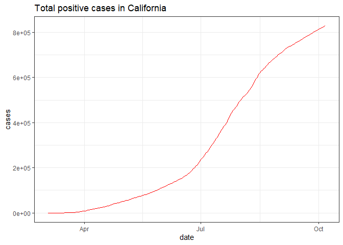
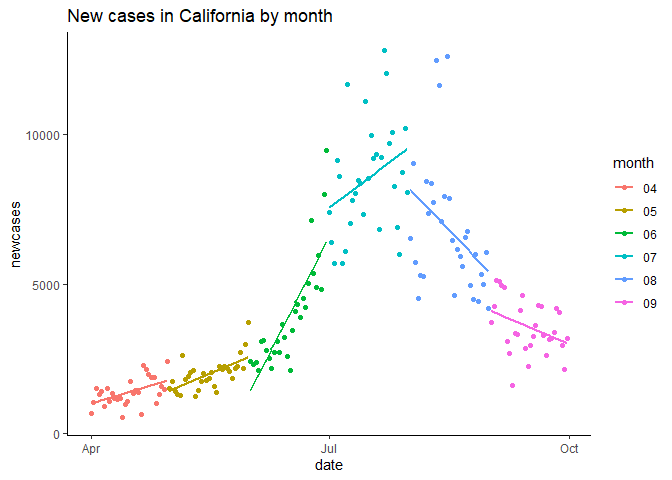

Midterm
================
Lin Wang
10/7/2020

# Introduction

``` r
# Get CA covid history data
dat <- data.table::fread("/Users/Hope/Documents/PM566-Midterm/california-history.csv")

dat <- dat[, .(date, state, death, deathIncrease, hospitalizedCurrently, hospitalizedIncrease, positive, positiveIncrease, totalTestResults)]

dat$date <- as.Date(dat$date)

# Create Quarter variable
dat[date>="2020-04-01" & date<="2020-06-30", Quarter := "Q1"]
dat[date>="2020-07-01" & date<="2020-09-30", Quarter := "Q2"]

covid_ca <- dat[date>="2020-04-01" & date<="2020-09-30"] 
covid_ca[order(date, decreasing = FALSE)]
```

    ##            date state death deathIncrease hospitalizedCurrently
    ##   1: 2020-04-01    CA   171            18                  1855
    ##   2: 2020-04-02    CA   203            32                  1922
    ##   3: 2020-04-03    CA   237            34                  2188
    ##   4: 2020-04-04    CA   276            39                  2300
    ##   5: 2020-04-05    CA   319            43                  2398
    ##  ---                                                           
    ## 179: 2020-09-26    CA 15532           134                  3203
    ## 180: 2020-09-27    CA 15587            55                  3129
    ## 181: 2020-09-28    CA 15608            21                  3160
    ## 182: 2020-09-29    CA 15640            32                  3223
    ## 183: 2020-09-30    CA 15792           152                  3267
    ##      hospitalizedIncrease positive positiveIncrease totalTestResults Quarter
    ##   1:                    0     8155              673            29927      Q1
    ##   2:                    0     9191             1036            33000      Q1
    ##   3:                    0    10701             1510            35300      Q1
    ##   4:                    0    12026             1325           113700      Q1
    ##   5:                    0    13438             1412           116533      Q1
    ##  ---                                                                        
    ## 179:                    0   798237             4197         14182730      Q2
    ## 180:                    0   802308             4071         14333498      Q2
    ## 181:                    0   805263             2955         14484852      Q2
    ## 182:                    0   807425             2162         14613545      Q2
    ## 183:                    0   810625             3200         14705202      Q2

``` r
# Get covid data of counties in CA
download.file("https://raw.githubusercontent.com/nytimes/covid-19-data/master/us-counties.csv", "us-counties.csv")
counties <- fread("us-counties.csv")
counties <- counties %>%
  filter(state == "California")

counties$date <- as.Date(counties$date)
```

``` r
# Overview of covid tests, deaths, hospitalizedIncrease, new cases in CA
ggplot(dat, mapping = aes(x = date, y = positive))+
  geom_line(color="red")+
  ggtitle("Total tested positive in California")+
  theme_bw()
```

<!-- -->

``` r
ggplot(dat)+
  geom_line(mapping = aes(x = date, y = death), na.rm = TRUE)+
  ggtitle("Total deaths in California")+
  theme_bw()
```

<!-- -->

``` r
ggplot(dat)+
  geom_point(mapping = aes(x = date, y = hospitalizedCurrently), na.rm = TRUE, col="#69b3a2")+
  ggtitle("Increased hospitalized cases in California")+
  theme_classic()
```

<!-- -->

``` r
ggplot(dat, mapping = aes(x = date))+
  geom_bar(aes(y = positiveIncrease), position = "stack", stat = "identity", na.rm = TRUE, col="#69b3a2")+
  ggtitle("New cases in California")+
  theme_classic()
```

<!-- -->

``` r
# New cases by quarters
ggplot(covid_ca)+
  geom_boxplot(mapping = aes(group = Quarter, y = positiveIncrease, color = Quarter, fill = Quarter, alpha = 0.5))+
  ggtitle("New cases in California by quarters")+
  theme_classic()
```

<!-- -->

``` r
# Take a look at different month
covid_ca1 = mutate(covid_ca, month=substr(covid_ca$date, 6, 7))
ggplot(covid_ca1)+
  geom_point(mapping = aes(x = date, y = positiveIncrease, color = month))+
  ggtitle("New cases in California by month")+
  theme_bw()
```

<!-- -->

``` r
ggplot(counties)+
  geom_line(mapping = aes(x = date, y = cases, color = factor(county)))
```

<!-- -->

# Methods

# Preliminary Results

# Conclusion

``` r
library(usmap)
```
